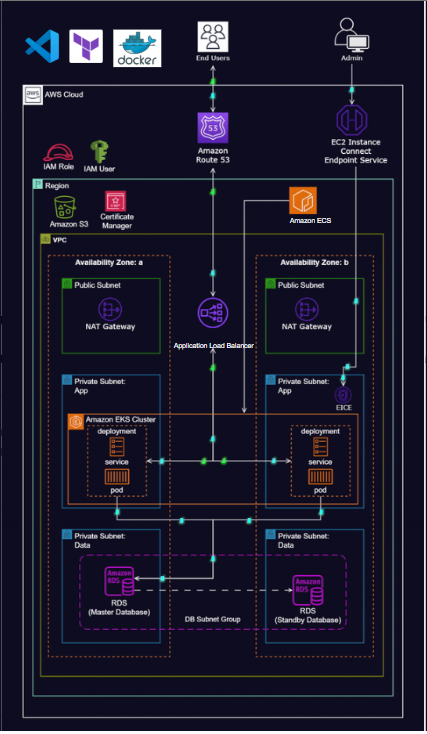
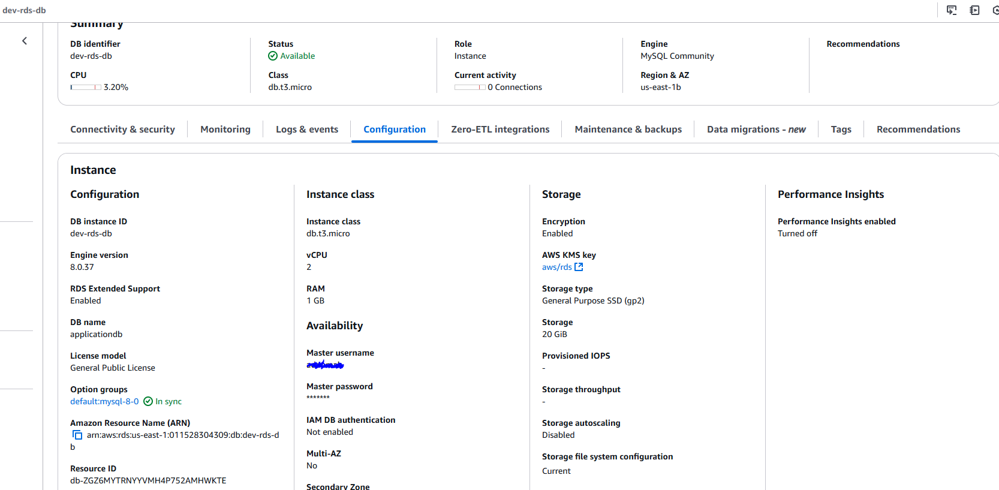
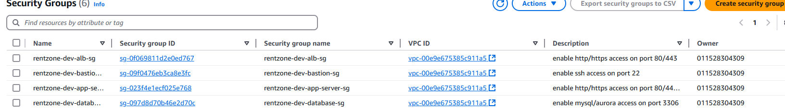

---

# Deploying a Dynamic Web Application on AWS with Terraform, Docker, Amazon ECR, and ECS

This repository contains Terraform Modules required to deploy and host a dynamic web application on Amazon Web Services (AWS) using a modern, infrastructure-as-code (IaC) approach. This project leverages a combination of powerful technologies:
 - **Terraform**: Automates the provisioning and management of AWS resources, ensuring a consistent and reproducible infrastructure.
 - **Docker**: Packages the web application and its dependencies into a portable container image.
 - **Amazon ECR** **(Elastic Container Registry)**: Stores and manages the Docker images for secure and reliable deployment.
 - **Amazon ECS (Elastic Container Service)** orchestrates the deployment and scaling of the containerized application across a cluster of EC2 instances.

## Key Features:

 - **Automated Infrastructure:** Terraform defines and manages all the necessary AWS resources, including VPCs, subnets, security groups, load balancers, ECS clusters, and more.
 - **Containerized Application:** Docker encapsulates the web application, making it platform-independent and easy to deploy.
 - **Scalable and Reliable:** ECS enables dynamic application scaling based on demand, ensuring high availability and performance.
 - **Secure Deployment:** ECR provides a private registry for storing and managing Docker images, enhancing security.
 - **Reproducible Environment:** The entire infrastructure and application deployment is coded in Terraform, allowing for easy replication and disaster recovery.
### Benefits:

 - **Simplified Deployment:** Streamlines deploying complex web applications on AWS.
 - **Increased Agility:** Enables rapid iteration and updates to the application and infrastructure.
 - **Reduced Operational Overhead:** Automates infrastructure management, freeing up time and resources.
 - **Improved Consistency:** Ensures consistent deployments across different environments (development, staging, production).
 - **Enhanced Security:** Leverages AWS security best practices and containerization to protect the application and data.

#### Architecture Overview

The Dynamic Web Application is deployed on AWS using Terraform, Docker, ECR, and ECS. Through the use of these tools, a rugged, scalable, and secure infrastructure can easily be generated using the Terraform Modules to produce the following:

 - **Virtual Private Cloud (VPC):** This project utilizes Terraform to automate the deployment of a dynamic web application on AWS.  The application is containerized using Docker and deployed on an ECS cluster within a secure and scalable VPC.  Key features include a 3-tier network architecture, an Application Load Balancer, and an RDS database instance. 
   * This VPC is set up with public and private subnets across two Availability Zones (AZs) for fault tolerance and high availability. It is important to note within this project, the multi_az_deployment variable in the terraform.tfvars file is set to false, meaning  there is only one primary database instance in a single AZ. While this simplifies the deployment, it means that if the AZ where the database resides experiences an outage, the database will become unavailable.  
 - **Subnets:** Subdivisions of the VPC that will allow us to group resources based on their security and access needs. This project utilizes:
   * **Public Subnets:** For internet-facing resources like the Application Load Balancer (ALB) and NAT Gateways.    
   * **Private Subnets:** For internal resources like the ECS cluster and RDS database, enhancing security.    
 - **Internet Gateway:** Enables communication between resources in VPC and the internet.    
 - **NAT Gateways:** Allow resources in private subnets to access the internet without being directly exposed to it.    

 - **Security Groups:** Act as virtual firewalls to control inbound and outbound traffic to your resources.    

 - **Application Load Balancer (ALB):** Distributes incoming web traffic across multiple targets, such as the ECS in this instance running the application, ensuring high availability and fault tolerance. Within this project's ALB, a listener is configured for both the HTTP/HTTPS (80/443) ports while monitored health is performed continuously.

 - **Amazon ECS (Elastic Container Service):** A fully managed container orchestration service capable of deploying, managing, and scaling containerized applications. Within this project deploying a web application through ECS allows us to scale web applications, perform batch processing, and run services through Virtual Machine Clusters.

     * **ECS Cluster:** A logical grouping of ECS container instances that host the application.

     * **ECS Task Definitions:** Blueprints for this application, defining the Docker image to use, resource requirements, and other configurations (IAM policies/roles), .    

     * **ECS Services:**  Manage the launch and scaling of tasks based on your defined task definitions.    

 - **Amazon ECR (Elastic Container Registry):** A fully managed Docker container registry that will store, manage, and deploy Docker images. Within this project, I used a previously stored container in the Amazon Elastic Container Repository.    

 - **Amazon RDS (Relational Database Service):** A managed relational database service that makes it easy to set up, operate, and scale a relational database in the cloud. Within this project, a snapshot is used for disaster recovery, acting as a backup to restore data in case of unforeseen events.  Snapshots allow for the quick creation of copies for testing and development without affecting the live environment.  Additionally, snapshots enable data migration and provide a historical record for compliance and auditing.  

 - **AWS Certificate Manager (ACM):**  Handles the complexity of creating and managing SSL/TLS certificates for your application, ensuring secure communication.    

 - **Amazon Route 53:** A highly available and scalable cloud Domain Name System (DNS) web service. For this project, I recycled the old domain used in my previous project (spaceadoo.com)

## Terraform Files and Their Functions

Here's a brief overview of the Terraform files in this project:

 - **acm.tf:**  Requests and validates SSL/TLS certificates using AWS Certificate Manager (ACM).    

 - **alb.tf:** Creates the Application Load Balancer (ALB), target groups, and listeners to distribute incoming traffic.    

 - **asg.tf:** Sets up the Auto Scaling group to automatically adjust the number of ECS tasks based on CPU utilization.    

 - **backend.tf:** Configures the Terraform backend to store the state file in an S3 bucket and lock it with DynamoDB.    

 - **ecs-role.tf:** Defines the IAM roles and policies required for the ECS tasks to interact with other AWS services.    

 - **ecs.tf:** Creates the ECS cluster, task definitions, and services to deploy and manage the containerized application.

 - **nat-gateway.tf:** Provisions NAT Gateways in the public subnets to allow resources in private subnets to access the internet.    

 - **output.tf:** Defines outputs, such as the website URL, that can be accessed after the infrastructure is deployed.    

 - **providers.tf:** Configures the AWS provider with the region and default tags.    

 - **rds.tf:** Creates the RDS database instance and associated resources.    

 - **route-53.tf:**  Creates Route 53 records to map the domain name to the load balancer.    

 - **s3.tf:** Creates an S3 bucket to store the environment file for the application.    

 - **security-groups.tf:** Defines the security groups for the different resources, controlling inbound and outbound traffic.    

 - **terraform.tfvars:** Contains the values for the variables used in the Terraform configuration.

 - **variables.tf:** Declares the variables used in the Terraform configuration.

 - **vpc.tf:** Creates the VPC, subnets, internet gateway, and route tables.

## Creating RDS DB using Terraform Modules (RDS Snapshot Alternative)

 - If you are not planning on using (or lack of) an RDS snapshot on your AWS account here is the terraform module to do so. I will refrain from adding this .tf file to the project folder to minimize confusion.
```
 - # configured aws provider with proper credentials
provider "aws" {
  region  = "us-east-1"
  profile = "terraform-user"
}


# create default vpc if one does not exit
resource "aws_default_vpc" "default_vpc" {

  tags = {
    Name = "default vpc"
  }
}


# use data source to get all avalablility zones in region
data "aws_availability_zones" "available_zones" {}


# create a default subnet in the first az if one does not exit
resource "aws_default_subnet" "subnet_az1" {
  availability_zone = data.aws_availability_zones.available_zones.names[0]
}

# create a default subnet in the second az if one does not exit
resource "aws_default_subnet" "subnet_az2" {
  availability_zone = data.aws_availability_zones.available_zones.names[1]
}

# create security group for the web server
resource "aws_security_group" "webserver_security_group" {
  name        = "webserver security group"
  description = "enable http access on port 80"
  vpc_id      = aws_default_vpc.default_vpc.id

 #inbound rules
  ingress {
    description      = "http access"
    from_port        = 80
    to_port          = 80
    protocol         = "tcp"
    cidr_blocks      = ["0.0.0.0/0"]
  }
#outbound rules
  egress {
    from_port        = 0
    to_port          = 0
    protocol         = -1
    cidr_blocks      = ["0.0.0.0/0"]
  }

  tags   = {
    Name = "webserver security group"
  }
}

# create security group for the database
resource "aws_security_group" "database_security_group" {
  name        = "database security group"
  description = "enable mysql/aurora access on port 3306"
  vpc_id      = aws_default_vpc.default_vpc.id

  ingress {
    description      = "mysql/aurora access"
    from_port        = 3306
    to_port          = 3306
    protocol         = "tcp"
    security_groups  = [aws_security_group.webserver_security_group.id]
  }

  egress {
    from_port        = 0
    to_port          = 0
    protocol         = -1
    cidr_blocks      = ["0.0.0.0/0"]
  }

  tags   = {
    Name = "database security group"
  }
}


# create the subnet group for the rds instance
resource "aws_db_subnet_group" "database_subnet_group" {
  name         = "database-subnets"
  subnet_ids   = [aws_default_subnet.subnet_az1.id, aws_default_subnet.subnet_az2.id]
  description  = "subnets for database instance"

  tags   = {
    Name = "database-subnets"
  }
}


# create the rds instance
resource "aws_db_instance" "db_instance" {
  engine                  = "mysql"
  engine_version          = "8.0.31"
  multi_az                = false
  identifier              = "dev-rds-instance"
  username                = "adoomabd" #create username
  password                = "adoom123" #create password
  instance_class          = "db.t3.micro" #review what class works best for you 
  allocated_storage       = 200
  db_subnet_group_name    = aws_db_subnet_group.database_subnet_group.name
  vpc_security_group_ids  = [aws_security_group.database_security_group.id]
  availability_zone       = data.aws_availability_zones.available_zones.names[0]
  db_name                 = "applicationdb"
  skip_final_snapshot     = true #this will make it so an additional snapshot is not created after every stoppage of this instance
}

```

## How to Use
This section provides a step-by-step guide on how to deploy the dynamic web application infrastructure using the Terraform code in this repository.

 - Prerequisites
   * An AWS account with appropriate permissions to create and manage the required resources.
   * Terraform installed on your local machine. You can download it from the official Terraform website: https://www.terraform.io/downloads.html   
   * Configure your AWS credentials. You can do this by setting up environment variables (AWS_ACCESS_KEY_ID and AWS_SECRET_ACCESS_KEY) or using an AWS credentials file.
    
## Deployment Steps

 - Clone the Repository using the following command:
   * **git clone [https://github.com/adoomabd/AdamAbdelrahim-Terraform-ECS-Project.git](https://github.com/AdamAbdelrahim/AdamAbdelrahim-Terraform-ECS-Project)**
 - Navigate to the Project Directory

 - Change your current directory to the cloned repository using the following command:
   * **cd AdamAbdelrahim-Terraform-ECS-Project**
    
 - Initialize Terraform and download necessary providers using the following command:
   * **terraform init**
 - Review the Terraform Plan. Before applying the changes, review the Terraform plan to see what resources will be created or modified.

 - If you're satisfied with the plan, apply the configuration to create the infrastructure:
   * **terraform apply**
 - Terraform will prompt you to confirm the changes. Type yes and press Enter to proceed.

 - Access the Application. Once the deployment is complete, you can access the web application through the Application Load Balancer's DNS name. The DNS name will be available in the Terraform output after the terraform apply command completes.

## Additional Notes

 - You can customize the deployment by modifying the variables in the terraform.tfvars file.
 - Pay attention to capitalization as certain words and values are CAPS-locked, "TCP" and "tcp" are not the same.
 - Pay attention to any notes within the .tf files, comments are included to help aid and guide the user with specific Terraform functions and modules.

 - To destroy the infrastructure and clean up the resources, run the following command:
    * **terraform destroy**


## Issues I Ran Into
- Terraform State Lock Issue. I faced an issue with Terraform state locking, likely caused by interrupting a previous Terraform apply process by closing the terminal mid-way. This prevented Terraform from releasing the lock on the state file in DynamoDB, causing subsequent Terraform apply commands to fail.

- To resolve this, I had to force unlock the state file using the following command:
   * **terraform force-unlock (id of issue)**
- Afterwards, I had to delete (in this instance) the RDS and ACM requests within the AWS management console and reprovision these resources using the Terraform command:
   * **terraform apply -target=((resourcetype)(resourcename))**
## Contributing

Contributions to this project are welcome! Please fork the repository and submit a pull request with your enhancements.

Credit to AOSNotes for helping me complete this project.

## AWS Management Console Configuration 






